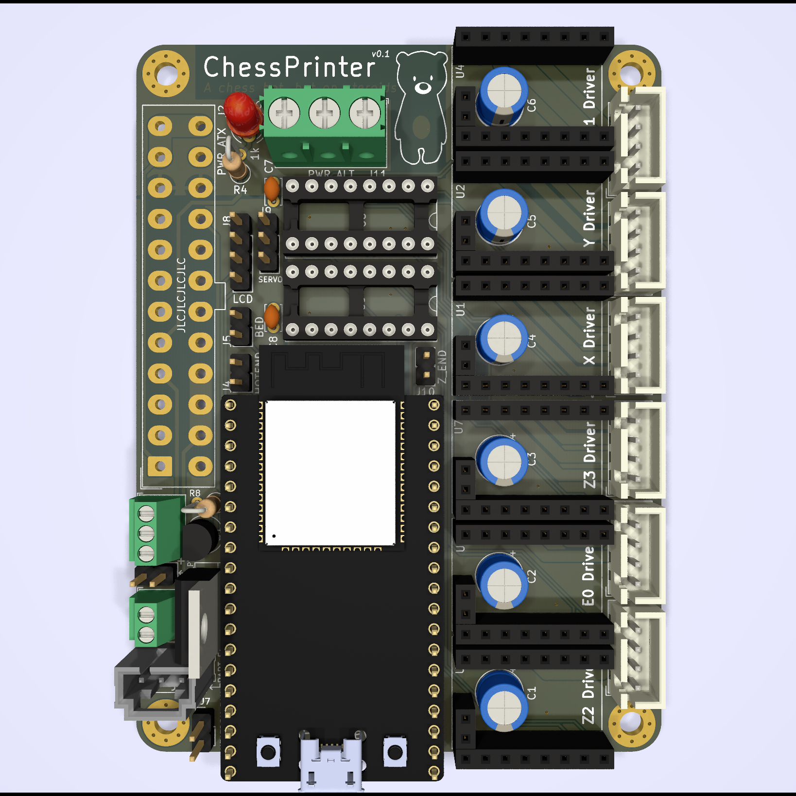

# Chess Printer

> A chess bot, but on steroids.

  
  

A completely custom-designed 3D printer control board with
an ESP32 MCU. Designed to control a CoreXY printer, but can
probably be adapted to any kinematic system.

> **Warning**: This is an experimental project with no gurantees - use at
> your own risk and discretion!

## Notable Features

* 6 stepper drivers (labelled X, Y, E0, Z1, Z2 & Z3)
  - Designed for TMC2209 drivers
  - 1-wire Serial communication with all drivers supported
* ATX & screw terminal power input
  - `PS-ON` control (standby & emergency kill poweroff supported in Marlin)
  - MCU can be powered from `5VSB` ATX power rail with jumper selection
    (**DO NOT** power via USB and `5VSB` concurrently - doing so will almost definitely damage _something_!)
* ESP32 MCU (DevKit-C footprint)
* I2S stepper stream
  - 2x daisy-chained `75HC595` shift registers
* I2C LCD
* 1 hotend & 1 heatbed thermistor input
* 1 high power MOSFET bed heater & 1 heatbed output (for external relay/SSR)
* 1 controllable & 1 always-on fan output
